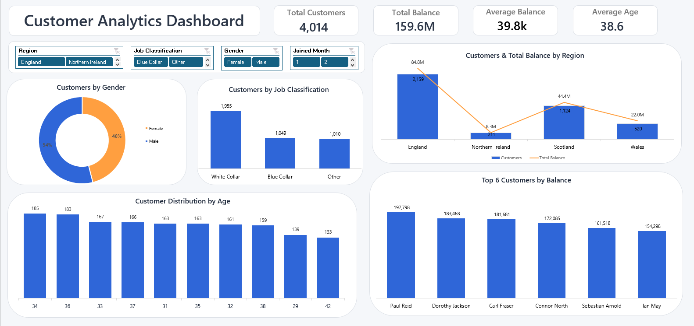

# 📊 Customer Analytics Dashboard

<p align="center">
  
</p>

An interactive **Business Intelligence Dashboard** built using **Microsoft Excel 365** to analyze customer demographics, financial performance, and regional distribution. The dashboard leverages **Pivot Tables**, **Pivot Charts**, **Slicers**, and **advanced Excel formulas** to transform raw customer data into meaningful business insights through an intuitive and professional dashboard interface.

---

# 📑 Table of Contents

- Project Overview
- Business Objectives
- Dashboard KPIs
- Dashboard Components
- Dashboard Design Highlights
- Tools & Technologies
- Dataset
- Key Features
- Business Questions Answered
- Key Business Insights
- Skills Demonstrated
- Business Value
- Repository Structure
- How to View the Dashboard
- Future Improvements
- Author

---

# 📌 Project Overview

This project demonstrates how **Microsoft Excel** can be used as a powerful **Business Intelligence** tool to build an interactive dashboard for customer analytics.

The dashboard transforms raw customer data into valuable business insights using **Pivot Tables**, **Pivot Charts**, **Slicers**, **Excel formulas**, and KPI Cards while following a clean Microsoft-inspired dashboard design.

---

# 🎯 Business Objectives

- Analyze customer distribution across different regions.
- Monitor key customer performance indicators.
- Evaluate customer balances.
- Explore customer demographics.
- Identify high-value customers.
- Support business decision-making through interactive reporting.

---

# 📊 Dashboard KPIs

- Total Customers
- Total Balance
- Average Balance
- Average Age

---

# 📈 Dashboard Components

## Executive Dashboard

Provides a high-level overview of customer performance using interactive business intelligence reporting.

### Highlights

- Executive KPI Cards
- Interactive Slicers
- Customer Distribution by Region
- Gender Distribution
- Age Analysis
- Job Classification Analysis
- Top Customers by Balance
- Dynamic Pivot Charts

---

# 🎨 Dashboard Design Highlights

The dashboard follows modern Microsoft dashboard design principles to provide a clean and user-friendly reporting experience.

### Design Features

- Microsoft-inspired dashboard layout
- Executive KPI Cards
- Professional color palette
- Interactive Slicers
- Rounded dashboard containers
- Consistent typography
- Balanced spacing and alignment
- Clean visual hierarchy
- Business-focused dashboard design
- Optimized dashboard layout
- Improved readability

---

# 🛠️ Tools & Technologies

- Microsoft Excel 365
- Pivot Tables
- Pivot Charts
- Slicers
- Advanced Excel Formulas
- Dashboard Design
- Data Visualization
- Business Intelligence Reporting
- Interactive Reporting

---

# 📂 Dataset

The dashboard is built using a customer dataset containing:

- Customer ID
- Customer Name
- Surname
- Gender
- Age
- Region
- Job Classification
- Date Joined
- Balance

---

# 📊 Key Features

- Executive KPI Cards
- Interactive Dashboard
- Interactive Slicers
- Pivot Tables
- Pivot Charts
- Customer Segmentation
- Regional Analysis
- Financial Analysis
- Customer Demographics
- Top Customer Analysis
- Dynamic Filtering
- Interactive Reporting

---

# ❓ Business Questions Answered

- How many customers does the business have?
- What is the total customer balance?
- What is the average customer balance?
- What is the average customer age?
- Which regions have the largest customer base?
- How are customers distributed by gender?
- Which job classifications have the highest customer count?
- Who are the top customers based on account balance?

---

# 💡 Key Business Insights

- Customer distribution varies across different regions.
- A relatively small number of customers contribute a significant portion of the total balance.
- Customer demographics reveal different age distributions.
- Job classifications vary considerably in customer count.
- Interactive slicers enable quick exploration of customer segments and business performance.

---

# 💼 Skills Demonstrated

- Microsoft Excel Dashboard Development
- Business Intelligence Reporting
- Dashboard Design
- KPI Development
- Data Cleaning
- Data Analysis
- Data Visualization
- Pivot Tables
- Pivot Charts
- Interactive Slicers
- Dashboard Layout Design
- Business Storytelling
- Interactive Reporting

---

# 💼 Business Value

This dashboard enables stakeholders to:

- Monitor customer performance.
- Analyze financial metrics.
- Explore customer demographics.
- Compare regional performance.
- Identify high-value customers.
- Interactively filter customer segments.
- Support business decisions through data-driven insights.

---

# 📂 Repository Structure

```text
Customer-Analytics-Dashboard
│
├── README.md
├── Customer_Analytics_Dashboard.xlsx
└── Customer_Analytics_Dashboard.png
```

> **Note:** The dashboard is fully interactive inside the Excel workbook using Pivot Tables, Pivot Charts, and Slicers.

---

# 🚀 How to View the Dashboard

1. Download or clone this repository.
2. Open **Customer_Analytics_Dashboard.xlsx** using Microsoft Excel.
3. Use the interactive slicers to explore different customer segments.
4. Analyze the KPI cards and charts to gain business insights.
5. View **Customer_Analytics_Dashboard.png** for a quick dashboard preview.

---

# 🔮 Future Improvements

- Power Query Integration
- VBA Automation
- Customer Segmentation Dashboard
- Customer Lifetime Value (CLV) Analysis
- Time-Series Customer Analysis
- Power BI Version
- Predictive Customer Analytics using Machine Learning

---

# 👤 Author

**Omnia Mohamed**

**Aspiring Data Analyst**

- 💼 LinkedIn: https://www.linkedin.com/in/omnia26
- 🐙 GitHub: https://github.com/omnia-mohamed26

---

⭐ If you found this project useful, consider giving it a **Star** on GitHub.
